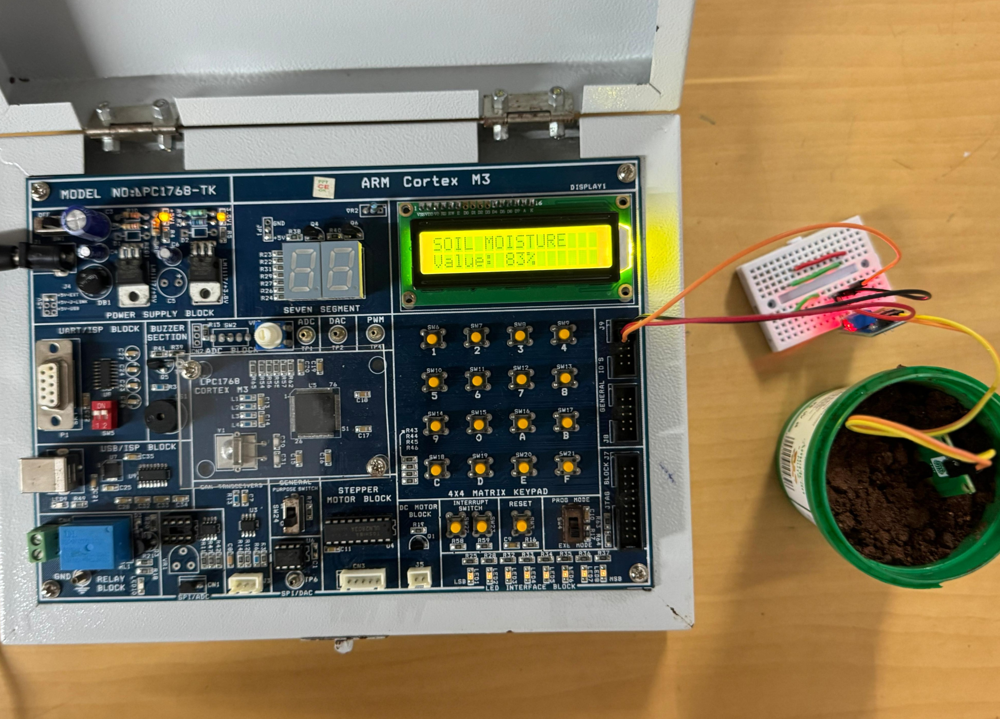

# 🌱 Soil Moisture Monitoring System using LPC1768

## 📌 Overview

This project implements a **real-time soil moisture monitoring system** using the **LPC1768 ARM Cortex-M3 microcontroller** and a soil moisture sensor. The analog output from the sensor is read through the inbuilt **12-bit ADC** of the LPC1768, processed into a moisture percentage, and displayed on the onboard **16x2 LCD**.

The system can be used in **smart irrigation**, **agriculture automation**, **plant monitoring**, and embedded sensor applications.

---

## 🛠️ Hardware Used

* LPC1768 Trainer Kit (ARM Cortex-M3)
* Soil Moisture Sensor Module
* 16x2 LCD Display (Onboard)
* Jumper Wires
* Breadboard
* USB / DC Power Supply

---

## 💻 Software Used

* Embedded C
* Keil µVision IDE
* Flash Magic (for flashing HEX file)

---

## ⚙️ Working Principle

* The soil moisture sensor measures conductivity between probes.
* **Dry soil** gives higher ADC values.
* **Wet soil** gives lower ADC values.
* LPC1768 reads the analog signal using ADC channel **AD0.0 (P0.23)**.
* The ADC value is calibrated and converted into **0%–100% moisture level**.
* The result is shown live on the LCD display.

---

## 📷 Project Setup



---

## 🖥️ LCD Output Example

```text
SOIL MOISTURE
Value: 83%
```

---

## 📂 Repository Structure

```text
soil-moisture-monitor-lpc1768/
│── README.md
│── src/
│   └── moisture.c
│── Images/
│   └── Soil_Moisture_LPC1768.jpg
│── hex/
│   └── moisture.hex
```

---

## 🚀 Features

* Real-time moisture sensing
* LCD percentage display
* ADC interfacing with LPC1768
* Embedded C implementation
* Simple and low-cost design

---

## 🔮 Future Improvements

* Automatic water pump control using relay
* IoT monitoring through Wi-Fi / GSM
* Mobile alerts for dry soil
* Data logging and analytics

---

## 📜 License

This project is developed for educational and learning purposes.
